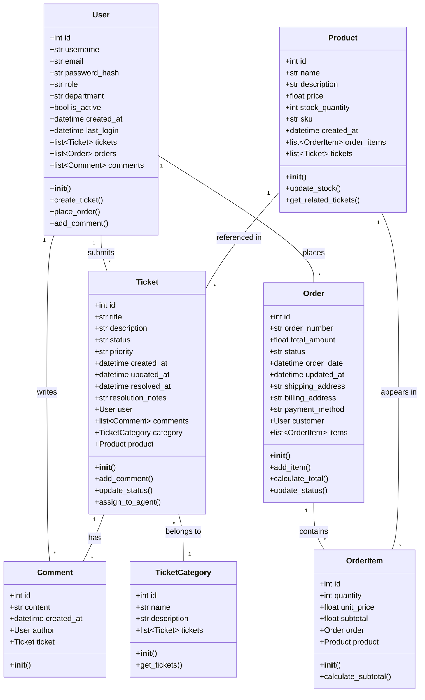

# Class Diagram for IT Support Portal

```mermaid
classDiagram
    class User {
        +int id
        +str username
        +str email
        +str password_hash
        +str role
        +str department
        +bool is_active
        +datetime created_at
        +datetime last_login
        +list~Ticket~ tickets
        +list~Order~ orders
        +list~Comment~ comments
        +__init__()
        +create_ticket()
        +place_order()
        +add_comment()
    }

    class Ticket {
        +int id
        +str title
        +str description
        +str status
        +str priority
        +datetime created_at
        +datetime updated_at
        +datetime resolved_at
        +str resolution_notes
        +User user
        +list~Comment~ comments
        +TicketCategory category
        +Product product
        +__init__()
        +add_comment()
        +update_status()
        +assign_to_agent()
    }

    class Comment {
        +int id
        +str content
        +datetime created_at
        +User author
        +Ticket ticket
        +__init__()
    }

    class TicketCategory {
        +int id
        +str name
        +str description
        +list~Ticket~ tickets
        +__init__()
        +get_tickets()
    }

    class Order {
        +int id
        +str order_number
        +float total_amount
        +str status
        +datetime order_date
        +datetime updated_at
        +str shipping_address
        +str billing_address
        +str payment_method
        +User customer
        +list~OrderItem~ items
        +__init__()
        +add_item()
        +calculate_total()
        +update_status()
    }

    class OrderItem {
        +int id
        +int quantity
        +float unit_price
        +float subtotal
        +Order order
        +Product product
        +__init__()
        +calculate_subtotal()
    }

    class Product {
        +int id
        +str name
        +str description
        +float price
        +int stock_quantity
        +str sku
        +datetime created_at
        +list~OrderItem~ order_items
        +list~Ticket~ tickets
        +__init__()
        +update_stock()
        +get_related_tickets()
    }

    User "1" -- "*" Ticket : submits
    User "1" -- "*" Order : places
    User "1" -- "*" Comment : writes
    Ticket "1" -- "*" Comment : has
    Ticket "*" -- "1" TicketCategory : belongs to
    Order "1" -- "*" OrderItem : contains
    Product "1" -- "*" OrderItem : appears in
    Product "1" -- "*" Ticket : referenced in
```
 